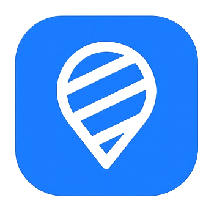

<div align="center">



# SafeTrack Kids

### An IoT-Based Child Safety Tracking System for Events

[](https://www.iau.edu.sa)
[](#)
[](#hardware)
[](#hardware)
[](#)

> **SafeTrack Kids** bridges the gap in child safety at large-scale events — combining IoT wearable technology with a real-time web platform to give parents peace of mind and organizers full situational awareness.

</div>

---

## 📋 Table of Contents

- [Overview](#overview)
- [Problem Statement](#problem-statement)
- [Proposed Solution](#proposed-solution)
- [System Architecture](#system-architecture)
- [Hardware](#hardware)
- [Software Stack](#software-stack)
- [Key Features](#key-features)
- [Screenshots](#screenshots)
- [Results](#results)
- [Documentation](#documentation)
- [Team](#team)

---

## Overview

SafeTrack Kids is a **B2B2C IoT platform** purpose-built for events. Event organizers subscribe to the platform and distribute **LILYGO T-Watch S3 Plus** smartwatches to attending families as a rental service.

**How it works:**

1. 🏟️ **Organizer** subscribes to SafeTrack, sets up the event, and configures a geofence around the venue
2. 📦 **Parent** receives a T-Watch at the event entrance
3. 📱 **Parent** scans the QR code on the device — child is instantly registered via web portal (no app install required)
4. 📍 **Live tracking** begins — parents monitor their child on a personal dashboard
5. 🚨 **Alert** — if the child exits the geofence, both parent and organizer receive instant alerts and the bracelet triggers haptic feedback
6. 🔒 **Post-event** — all data is permanently deleted and devices are reset

---

## Problem Statement

| Gap | Impact |
|-----|--------|
| Existing wristband/RFID solutions lack real-time GPS tracking | Parents have no live visibility at outdoor events |
| No centralized organizer dashboard | Staff cannot monitor multiple children simultaneously |
| Child identification relies on manual intervention | Critical delays during emergency situations |
| No real-time boundary breach detection | Exits go unnoticed until it's too late |
| Systems retain child data after events | Serious privacy and compliance risks |
| No scalable B2B2C rental model | Families must purchase expensive hardware |

---

## Proposed Solution

SafeTrack Kids addresses all six gaps with a unified platform:

- ✅ **Smart wearable** — LILYGO T-Watch S3 Plus with GPS, LoRa SX1262, haptic motor & 940 mAh battery
- ✅ **QR code registration** — instant bracelet-to-child pairing via web portal
- ✅ **Parent Dashboard** — real-time child location, movement history, and alerts
- ✅ **Organizer Dashboard** — centralized multi-child map, geofence configuration, alert management
- ✅ **Geofence alerts** — dispatched within **5 seconds** of breach + haptic feedback on bracelet
- ✅ **Privacy by design** — automatic post-event data deletion, zero retained child data

---

## System Architecture

```
┌─────────────────────────────────────────────────────────┐
│                    SafeTrack Kids                        │
├──────────────┬──────────────────┬───────────────────────┤
│  T-Watch     │   Backend        │   Web Dashboards       │
│  Bracelet    │   Server         │                        │
│              │                  │  ┌─────────────────┐   │
│  ESP32-S3    │  REST API        │  │ Parent View     │   │
│  GPS         │  Geofence Engine │  │ Live location   │   │
│  LoRa        │  Alert System    │  │ Alert history   │   │
│  Haptic      │  Event Manager   │  └─────────────────┘   │
│  940mAh      │                  │  ┌─────────────────┐   │
│              │  Database        │  │ Organizer View  │   │
│              │  (auto-deleted   │  │ All children    │   │
│              │   post-event)    │  │ Geofence config │   │
└──────────────┴──────────────────┴──┴─────────────────┴───┘

Data flow: GPS → WiFi (HTTP POST) → REST API → Real-time Dashboards
           GPS → LoRa (10s interval / 3s on alert) → Backend
```

---

## Hardware

### LILYGO T-Watch S3 Plus

| Component | Specification |
|-----------|--------------|
| **Processor** | ESP32-S3 |
| **Display** | 1.54" LCD (ST7789V) |
| **Wireless** | WiFi + LoRa SX1262 |
| **Positioning** | GPS Module |
| **Battery** | 940 mAh (AXP2101 PMU) |
| **Alerts** | DRV2605 Haptic Motor |
| **Sensors** | BMA423 Accelerometer, FT6236U Touch |
| **RTC** | BM8563 |
| **Additional** | Speaker, PIR Sensor |

> 📸 *Hardware photos coming soon*

---

## Software Stack

| Layer | Technology |
|-------|-----------|
| **Firmware** | Arduino IDE / ESP-IDF (ESP32-S3) |
| **Frontend** | Next.js — Responsive Web App (Parent & Organizer Views) |
| **Backend** | REST API Server + Geofence Engine |
| **Database** | Event Data Store (auto-deleted post-event) |
| **Communication** | LoRa SX1262 (device ↔ backend), WiFi HTTP POST |

---

## Key Features

### 🗺️ Real-Time GPS Tracking
Location updates every **10 seconds** under normal conditions, switching to **3-second intervals** when an alert is triggered.

### 📍 Geofence Breach Detection
Alerts dispatched to parent dashboard, organizer dashboard, and bracelet haptic motor within **5 seconds** of boundary breach.

### 📱 QR Code Registration
No app installation required. Parent scans QR code on the bracelet → child is registered and tracking begins instantly.

### 🔒 Privacy by Design
All child data is permanently deleted and devices fully reset at the end of each event — zero data retained.

### 👨‍👩‍👧 Dual Dashboard System
- **Parent View** — personal child tracking, alert history
- **Organizer View** — all children on one map, geofence configuration, alert management

---

## Screenshots

> 📸 *Screenshots and demo videos will be added upon completion of frontend integration.*

### Parent Dashboard
<!-- Add screenshot here -->

### Organizer Dashboard
<!-- Add screenshot here -->

### Bracelet & Hardware
<!-- Add hardware photos here -->

---

## Results

| Metric | Target | Status |
|--------|--------|--------|
| Location Update Interval | 10s | ✅ Achieved |
| Alert Response Time | < 5s | ✅ Achieved |
| Post-Event Data Retained | 0 | ✅ Achieved |
| QR Code Registration | Instant | ✅ Achieved |
| App Installation Required | None | ✅ Achieved |

---

## Documentation

The following documents have been produced as part of the graduation project:

| Document | Description |
|----------|-------------|
| **SPMP** | Software Project Management Plan |
| **SRS** | Software Requirements Specification |
| **SDS** | Software Design Specification (with full UML diagrams) |
| **STP** | Software Test Plan |

UML diagrams included: Use Case, Class, Sequence, Activity

---

## Team

| Name | Role |
|------|------|
| **Abdulrahman Hassan Alshahrani** | Project Manager & Technical Lead |
| **Abdullah Tariq Alkhatrawi** | Team Member |
| **Turki Mohammed Al Abdullatif** | Team Member |
| **Mohammed Abbas Alfuraih** | Team Member |
| **Odai Thwab Alharthi** | Team Member |
| **Mr. Yousof Almunsour** | Supervisor |

**Institution:** Imam Abdulrahman bin Faisal University — College of Computer Science and Information Technology

**Graduation Project Showcase 11 · 2025–2026**

---

<div align="center">

Made with ❤️ at IAU · College of Computer Science and IT

</div>
